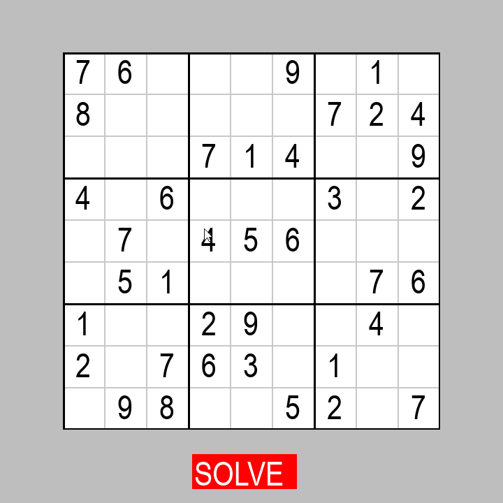

# Sudoku-Game

## Table of Contents

* [Installation](#Installation)
* [Release History](#Release-History)
* [Meta](#Meta)
* [Contributing](#Contributing)

## Release History
  
  Version : 0.1

## Meta

Doğukan Demir – [@demirdogukan](https://github.com/demirdogukan) – dogukan.demir@yahoo.com

Telegram - Maestro_20

***Any licence won't be added and for using the game in your project just contact with me via telegram or mail***
